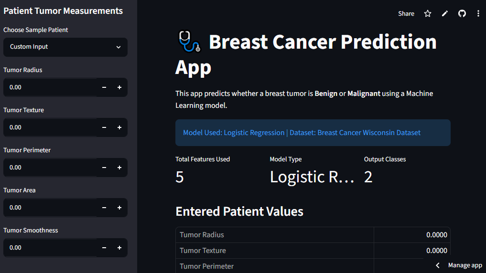
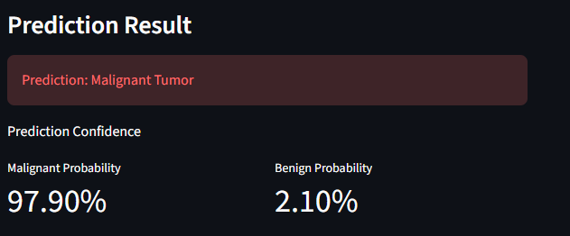

# 🩺 Breast Cancer Prediction Web Application

A machine learning web application built using Streamlit and Logistic Regression to predict whether a breast tumor is **Benign** or **Malignant**.

## Project Overview

This project uses the Breast Cancer Wisconsin Dataset and a Logistic Regression model to classify tumors based on selected clinical features.

The application provides:

* Real-time prediction
* Prediction probabilities
* Interactive user interface
* Sample patient testing
* Streamlit Cloud deployment

---

## Live Demo

Add your deployed Streamlit URL here:

```text
https://appappprojects-khjupjdmylgrzpacasmttd.streamlit.app/ 
```

---

## Model Information

| Item          | Value                           |
| ------------- | ------------------------------- |
| Algorithm     | Logistic Regression             |
| Dataset       | Breast Cancer Wisconsin Dataset |
| Accuracy      | 98.25%                          |
| Features Used | 5                               |
| Deployment    | Streamlit Cloud                 |

---

## Features Used

* Mean Radius
* Mean Texture
* Mean Perimeter
* Mean Area
* Mean Smoothness

---

## Technologies Used

* Python
* Streamlit
* Scikit-Learn
* NumPy
* Pandas
* Pickle
* Git & GitHub

---

## Project Structure

```text
breast_cancer_app/
│
├── app.py
├── train_model.py
├── requirements.txt
│
└── models/
    ├── breast_cancer_model.pkl
    ├── scaler.pkl
    └── features.pkl
```

---

## Results

Model Performance:

* Accuracy: 98.25%
* Precision: 98%
* Recall: 98%
* F1 Score: 98%

Classification Report:

```text
Accuracy: 0.9825

Precision: 0.98
Recall: 0.98
F1-Score: 0.98
```

---

## Application Screenshots

Add screenshots here:

### Home Page



### Prediction Result



---

## Learning Outcomes

Through this project, I learned:

* Data preprocessing
* Feature scaling
* Logistic Regression
* Model serialization using Pickle
* Streamlit development
* Machine learning deployment
* GitHub project management
* Cloud deployment

---